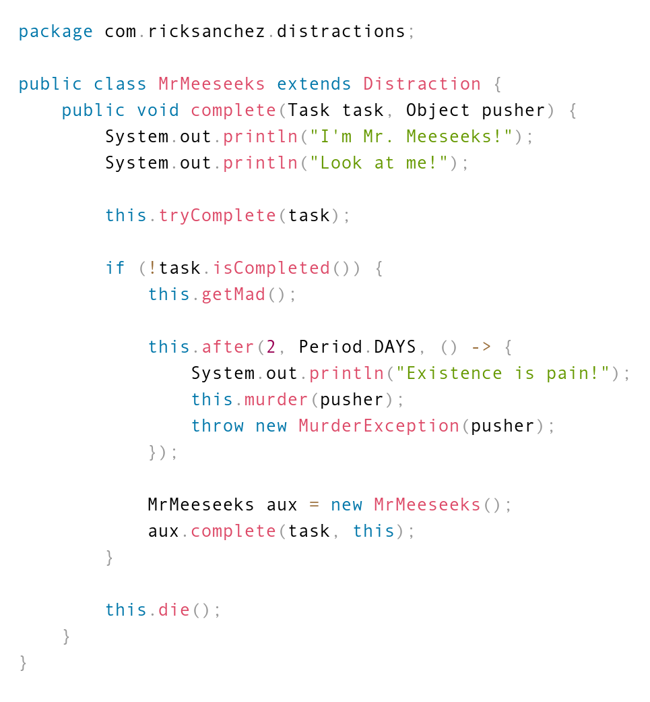

<h1 align="center">
  src2img
</h1>

<div align="center">
  <a href="https://npmjs.org/package/src2img">
    
  </a>
  <a href="https://bundlephobia.com/result?p=src2img">
    
  </a>
</div>

<div align="center">
  Converts source code to high quality images.
</div>

## Install

```sh
$ npm i src2img
```

## Usage

```js
import { promises as fs } from 'fs'
import src2img from 'src2img'
import { join } from 'path'

const src = 'path/to/sources'
const out = 'path/to/out'

const names = await fs.readdir(src)
const srcs = Promise.all(
  names.map(async name => ({
    name,
    src: await fs.readFile(join(src, name), `utf8`)
  }))
)

const images = await src2img({
  fontSize: 20, // Font size and unit control the size and quality of the image
  fontSizeUnit: 'pt',
  padding: 3,
  paddingUnit: 'vw', // Using 'px' does not scale with font size
  type: 'png', // png or jpeg
  src: srcs.map(({ src }) => [
    src,
    `javascript` // https://prismjs.com/index.html#languages-list
    // See https://www.npmjs.com/package/filename2prism for getting alias from filename
  ])
})

await Promise.all(
  images.map((image, i) =>
    fs.writeFile(
      join(out, `${srcs[i].name.replace(/\.[^.]+$/g, '')}.png`),
      image
    )
  )
)
```

Look at the [CLI package](https://www.npmjs.com/package/src2img-cli) if you'd
like to use this from the command line.

Some rendered code:



## Related

- [filename2prism](https://www.npmjs.com/package/filename2prism)
- [src2img-cli](https://www.npmjs.com/package/src2img-cli)
- [prismjs](https://www.npmjs.com/package/prismjs)

## Contributing

Stars are always welcome!

For bugs and feature requests,
[please create an issue](https://github.com/TomerAberbach/src2img/issues/new).

## License

[MIT](https://github.com/TomerAberbach/src2img/blob/main/license) ©
[Tomer Aberbach](https://github.com/TomerAberbach)
